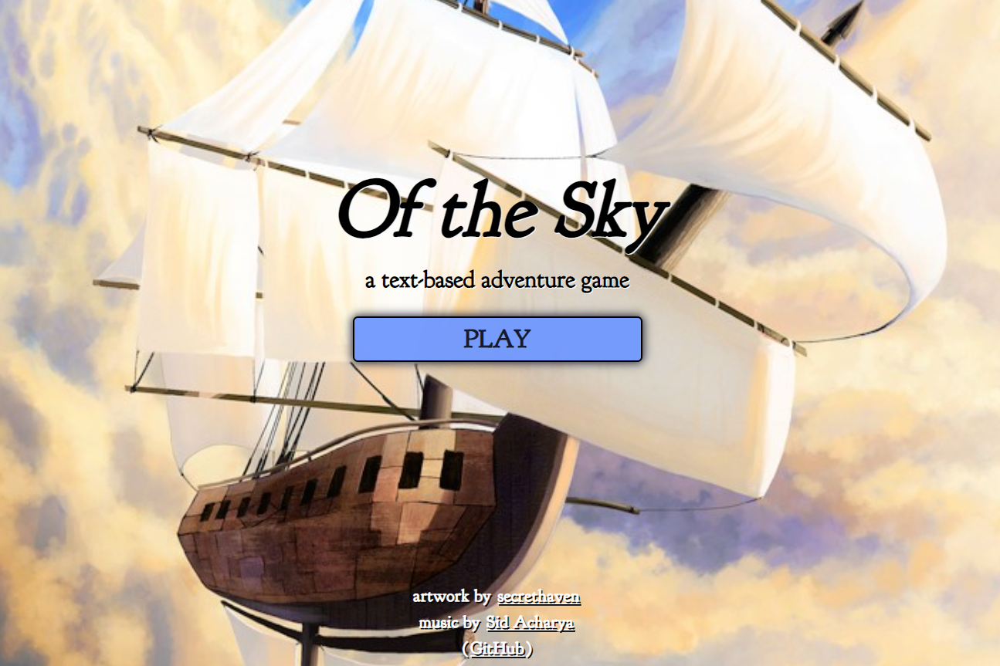

# [Of the Sky: The Game](https://oftheskygame.netlify.app/)
## CURRENTLY IN PROGRESS

### Overview:
- A choice-based text game that utilizes JavaScript objects, enabling the player to make choices and traverse through the game.
- The game branches into various subplots, ultimately leading to two different endings.
- It features a main menu, an exit menu pop-up, and toggleable music.
- [See it in action](https://oftheskygame.netlify.app/)

### Built With:
1. JavaScript
2. CSS
3. HTML

### Photo:

### Contact:

- [Portfolio Website](https://plambo.world)
- [Email](mailto:austinplambeck@gmail.com)
- [LinkedIn](https://www.linkedin.com/in/austinplambeck/)

 
